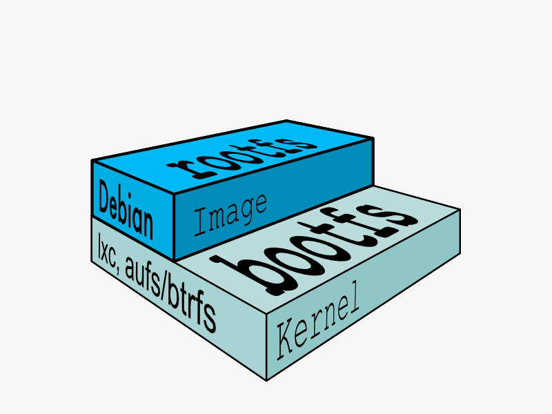

# 镜像的构成

## 定制自己的基础镜像

scratch 是一个空镜像，可以理解为几乎不包含任何东西。

scratch 可以作为构建任何基础镜像的基础，比如: ubuntu、alpine 等 docker 提供的官方基础镜像都是以 scratch 为基础构件的。

- [dockerhub scratch](https://hub.docker.com/_/scratch)
  - [dockerhub ubuntu](https://hub.docker.com/_/ubuntu)
    - [Dockerfile](https://github.com/tianon/docker-brew-ubuntu-core/tree/88ba31584652db8b96a29849ea2809d99ce3cc31/jammy)
  - [dockerhub alpine](https://hub.docker.com/_/alpine)
    - [Dockerfile](https://github.com/alpinelinux/docker-alpine/tree/fc965e3222f368bea8e07c1c1da70b6928281a76/x86_64)


## 文件系统和分层

- [docker docs: image、container、layers、fiilesystem](https://docker-doc.readthedocs.io/zh_CN/latest/terms/image.html)
### Linux File System


- boot file system (bootfs)
- root file system (rootfs)

The boot file system contains the bootloader and the kernel. The user never makes any changes to the boot file system. In fact, soon after the boot process is complete, the entire kernel is in memory, and the boot file system is unmounted to free up the RAM associated with the initrd disk image.

The root file system includes the typical directory structure we associate with Unix-like operating systems: /dev, /proc, /bin, /etc, /lib, /usr, and /tmp plus all the configuration files, binaries and libraries required to run user applications (like bash, ls, and so forth).


### Docker 文件系统

#### 镜像

- 

#### 镜像层是只读的，只有在容器运行时会有可读写的浅浅的容器层，容器销毁后，所有读写变更不会保留。

- 

#### 镜像分层和父子关系


#### 容器


```bash
# 宿主机构建程序，输出二进制可执行文件
make build

# 将可执行文件打包到我们的镜像中
make build-image
```

可以对比一下二进制文件和镜像的大小

```Dockerfile
FROM hello-image
RUN rm -rf /hello
```

## 参考

- [Docker - Create a base image](https://docs.docker.com/develop/develop-images/baseimages/)