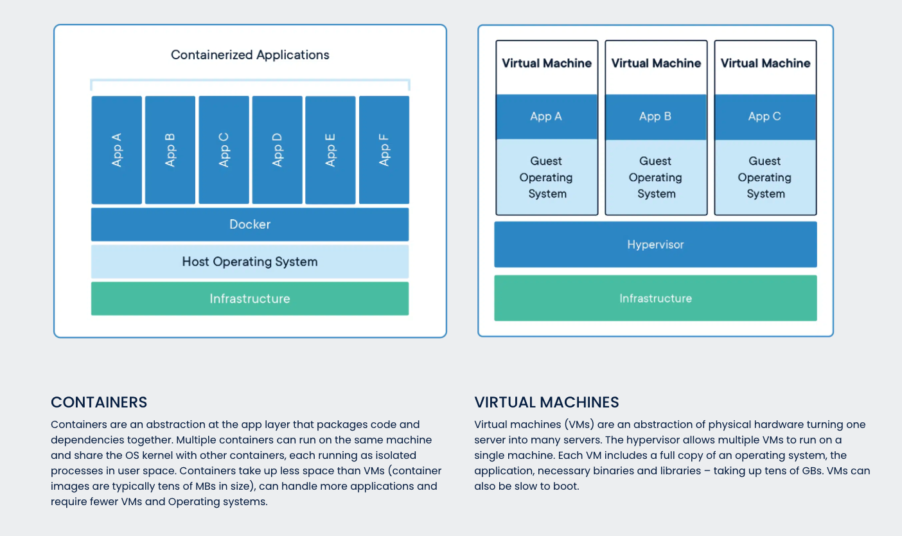
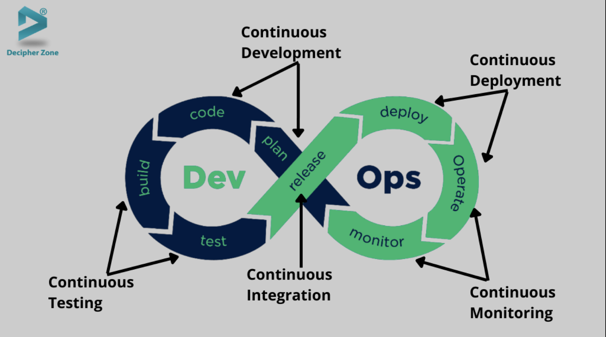

# docker-tutorial

## 为什么会出现容器

### 容器出现前是什么样子？

#### 开发环境

- 本机开发
  - 入手简单，不同系统OS 依赖安装复杂， 迁移配置麻烦，环境重用性差
- [Vagrant](https://github.com/hashicorp/vagrant)
  - [Vargant Command-Line Interface](https://www.vagrantup.com/docs/cli)
  - [Vagrant从使用到放弃再到掌握完全指南](https://jimmysong.io/blog/vagrant-intro/)
  - 通过命令行管理虚拟机（VirtualBox、VMware等），提供一个可配置，可移植可复用的软件开发环境。JetBrains 等IDE有很好的支持，提供近乎本地的开发体验
  
  ```ruby
  # 一个Vagrantfile 示例
  # https://github.com/hashicorp/vagrant/blob/main/Vagrantfile
  Vagrant.configure("2") do |config|
    config.vm.box = "hashicorp/bionic64"
    config.vm.hostname = "vagrant"
    config.ssh.shell = "bash -c 'BASH_ENV=/etc/profile exec bash'"

    ["vmware_desktop", "virtualbox", "hyperv"].each do |provider|
        config.vm.provider provider do |v, override|
        v.memory = "2048"
        end
    end

    # We split apart `install_rvm` from `setup_tests` because rvm says to
    # logout and log back in just after installing RVM.
    # https://github.com/rvm/ubuntu_rvm#3-reboot
    config.vm.provision "shell", path: "scripts/install_rvm"

    config.vm.provision "shell", path: "scripts/setup_tests"

    config.push.define "www", strategy: "local-exec" do |push|
        push.script = "scripts/website_push_www.sh"
    end

    config.push.define "docs", strategy: "local-exec" do |push|
        push.script = "scripts/website_push_docs.sh"
    end
  end
  ```
  
#### 测试

#### 服务部署


- 代码打包分发: git、npm、pypi、deb...
- 服务器依赖配置、应用分发、多机部署:  更新依赖、启动应用进程、更新负载均衡配置...
  - ansible
  - puppet
  - chef
  - salt
  - fabric
- 进程服务管理
  - [Supervisor/supervisor](https://github.com/Supervisor/supervisor)
  - [systemd/systemd](https://github.com/systemd/systemd)
  
  ```text
  # systemd 示例
  [Unit]
  Description=frida-server
  After=network.target
  [Service]
  Type=simple
  User=nobody
  Restart=always
  ExecStart=/usr/local/bin/adb shell "/data/local/tmp/frida-server -l 0.0.0.0"
  [Install]
  WantedBy=multi-user.target
  ```
  
## 容器

### 历史

- [2002 年 Namespaces 初版引入 kernel](https://en.wikipedia.org/wiki/Linux_namespaces)
  - [User namespaces progress](https://lwn.net/Articles/528078/)
  - Linux namespaces were inspired by the wider namespace functionality used heavily throughout Plan 9 from Bell Labs.
  - Adequate containers support functionality was finished in kernel version 3.8 with the introduction of User namespaces.
- [2007年 cgroup 被合并到 内核中](https://zh.wikipedia.org/wiki/Cgroups)
  - 2006年最早由Google工程师发起
- [2008年 LXC 通过将 Cgroups 的资源管理能力和 Linux Namespace 的视图隔离能力组合在一起，LXC 完整的容器技术出现在 Linux 内核中](https://en.wikipedia.org/wiki/LXC)
  - LXC 是第一个、最完整的 Linux 容器管理器的实现方案
- 2008 年 Google 发布GAE, 服务采用容器沙盒作为隔离机制
  - [App Engine 标准环境运行时](https://cloud.google.com/appengine/docs/standard/runtimes)
  - [google/gvisor](https://github.com/google/gvisor)

- [2009-2013 各家推出 SAE、DAE]
  - [新浪SAE架构](https://www.slideshare.net/zx0071/idcsae)
  - [百度BAE](https://cloud.baidu.com/doc/BAE-Pro/index.html)
  - 搜狐云景: [https://segmentfault.com/a/1190000000593788](https://segmentfault.com/a/1190000000593788)
  - 豆瓣DAE
    - [洪强宁介绍 Douban App Engine 的架构与特性](https://www.infoq.cn/article/2013/12/douban-app-engine)
    - [projecteru2/white-paper/blob/master/brief.md](projecteru2/white-paper/blob/master/brief.md)
    - [微服务自动伸缩落地实践](https://www.upyun.com/opentalk/309.html)
- [2013年 Docker 发布第一个开源版本](https://en.wikipedia.org/wiki/Docker_(software)
  - dockerd
  - docker cli
  - registry、dockerhub
  - compose
  - swarm

- [2014年 Kubernetes 发布第一个开源版本](https://en.wikipedia.org/wiki/Kubernetes)
  - [Borg、Omega 和 Kubernetes](https://jimmysong.io/kubernetes-handbook/cloud-native/kubernetes-history.html)

LXC是Linux内核提供的容器技术，能提供轻量级的虚拟化能力，能隔离进程和资源.

主要运用
Cgroups：重点在“限制”。限制资源的使用，包括CPU、内存、磁盘的使用，体现出对资源的管理能力。
Namespace：重点在“隔离”。隔离进程看到的Linux视图。说大白话就是，容器和容器之间不要相互影响，容器和宿主机之间不要相互影响。
UnionFS: 

如果对原理感兴趣可以看
- [coolshell 陈皓 docker相关系列文章](https://coolshell.cn/tag/docker)

### 自己实现一个基础的Docker

- [p8952/bocker](https://github.com/p8952/bocker)
- [xianlubird/mydocker](https://github.com/xianlubird/mydocker)
- [tonybaloney/mocker](https://github.com/tonybaloney/mocker)

- [使用 Shell 脚本实现 Docker](https://xie.infoq.cn/article/8d734fab6e07efe087175f8f4)


早期Docker 使用LXC， 后来使用纯Golang实现的[libcontainer](https://github.com/opencontainers/runc/tree/main/libcontainer)替换

Java : Write once, run anywhere
Docker: Build once，Run AnyWhere

当前官方的口号: [Accelerate how you build, share, and run modern applications.](https://www.docker.com/)

- build
- share
- run

### 容器与虚拟机的区别



- 标准化构建 Dockerfile
- 轻量 共享宿主机内核
- 启动快 秒级vs分钟级别
- 资源占用少
- 体积小




devops cicd

- [Aws: 什么是 DevOps？](https://aws.amazon.com/cn/devops/what-is-devops/)

  - DevOps 实践经验

    - 持续集成
    - 持续交付
    - 微服务
    - 基础设施即代码
    - 监控和日志记录
    - 沟通与合作

## 云计算 iaas paas saas

- [openstack/openstack](https://github.com/openstack/openstack)

openstack 面向资源层，管理vm

kubernetes 面向应用层，管理pod

### 镜像

#### Dockerfile

- https://github.com/wsargent/docker-cheat-sheet/tree/master/zh-cn#dockerfile
### 容器

### 仓库

### Docker CLI

- [docker commands](https://docs.docker.com/engine/reference/commandline/docker/)

```bash
attach     -- Attach local standard input, output, and error streams to a running container
build      -- Build an image from a Dockerfile
builder    -- Manage builds
buildx     -- Docker Buildx (Docker Inc., v0.8.1)
commit     -- Create a new image from a container's changes
compose    -- Docker Compose (Docker Inc., v2.3.3)
config     -- Manage Docker configs
container  -- Manage containers
context    -- Manage contexts
cp         -- Copy files/folders between a container and the local filesystem
create     -- Create a new container
daemon     -- Enable daemon mode
diff       -- Inspect changes to files or directories on a container's filesystem
events     -- Get real time events from the server
exec       -- Run a command in a running container
export     -- Export a container's filesystem as a tar archive
help       -- Show help for a command
history    -- Show the history of an image
image      -- Manage images
images     -- List images
import     -- Import the contents from a tarball to create a filesystem image
info       -- Display system-wide information
inspect    -- Return low-level information on Docker objects
kill       -- Kill one or more running containers
load       -- Load an image from a tar archive or STDIN
login      -- Log in to a Docker registry
logout     -- Log out from a Docker registry
logs       -- Fetch the logs of a container
manifest   -- Manage Docker image manifests and manifest lists
network    -- Manage networks
node       -- Manage Swarm nodes
pause      -- Pause all processes within one or more containers
plugin     -- Manage plugins
port       -- List port mappings or a specific mapping for the container
ps         -- List containers
pull       -- Pull an image or a repository from a registry
push       -- Push an image or a repository to a registry
rename     -- Rename a container
restart    -- Restart one or more containers
rm         -- Remove one or more containers
rmi        -- Remove one or more images
run        -- Run a command in a new container
save       -- Save one or more images to a tar archive (streamed to STDOUT by default)
scan       -- Docker Scan (Docker Inc., v0.17.0)
search     -- Search the Docker Hub for images
secret     -- Manage Docker secrets
service    -- Manage services
stack      -- Manage Docker stacks
start      -- Start one or more stopped containers
stats      -- Display a live stream of container(s) resource usage statistics
stop       -- Stop one or more running containers
swarm      -- Manage Swarm
system     -- Manage Docker
tag        -- Create a tag TARGET_IMAGE that refers to SOURCE_IMAGE
top        -- Display the running processes of a container
trust      -- Manage trust on Docker images
unpause    -- Unpause all processes within one or more containers
update     -- Update configuration of one or more containers
version    -- Show the Docker version information
volume     -- Manage volumes
wait       -- Block until one or more containers stop, then print their exit codes
```

### 基础镜像

#### [Docker Official Images](https://docs.docker.com/docker-hub/official_images/)

- [dockerhub 官方基础镜像](https://hub.docker.com/search?q=&type=image&image_filter=official)
- [docker-library/official-images](https://github.com/docker-library/official-images) 官方镜像仓库索引和一些制作基础镜像的最佳实践指导
- [Documentation for Docker Official Images in docker-library](https://github.com/docker-library/docs)

##### 官方基础镜像大概分类

- 基础的操作系统: ubuntu、centos等
- 流行的编程语言: python、nodejs、ruby、php、go等
- 流行的数据库或存储服务: mysql、postgresql、mongodb、redis、onsul、kafka、rabbitmq等
- 其他一些流行的应用: nginx、haproxy、wordpress等

### 制作基础镜像

#### [Docker Compose](https://docs.docker.com/compose/)

- [docker/awesome-compose](https://github.com/docker/awesome-compose) 官方提供的compose示例
  - [nginx-golang-mysql](https://github.com/docker/awesome-compose/tree/master/nginx-golang-mysql)
- [kubernetes/kompose](https://github.com/kubernetes/kompose)
  - [将 Docker Compose 文件转换为 Kubernetes 资源](https://kubernetes.io/zh/docs/tasks/configure-pod-container/translate-compose-kubernetes/)


#### 一些限制

- [kubernetes/kubernetes issues: Increase maximum pods per node](https://github.com/kubernetes/kubernetes/issues/23349#issuecomment-200484407)

- [oam-dev/kubevela](https://github.com/oam-dev/kubevela) The Modern Application Platform.
  - [如何构建以应用为中心的“Kubernetes”?](https://www.infoq.cn/article/phgbohj73sdpih3ropty)

## 云原生

- [The Twelve Factor App](https://12factor.net/zh_cn/)
- [云原生架构定义](https://jimmysong.io/kubernetes-handbook/cloud-native/cloud-native-definition.html)

## 参考

- [40 年回顾，一文读懂容器发展史](https://www.infoq.cn/article/ss6sitklgolexqp4umr5)
- [CNCF Cloud Native Landscape](https://landscape.cncf.io/)
- [gVisor in depth](https://blog.loof.fr/2018/06/gvisor-in-depth.html)
- [Open-sourcing gVisor, a sandboxed container runtime](https://cloud.google.com/blog/products/identity-security/open-sourcing-gvisor-a-sandboxed-container-runtime)
- [gVisor：谷歌发布的一个用于提供安全隔离的轻量级容器运行时沙箱](https://www.infoq.cn/article/2018/05/gvisor-container-sandbox)
- [Mesos 已死，容器永生](https://www.upyun.com/opentalk/309.html)
- [rkt/rkt](https://github.com/rkt/rkt)
- [美团点评Docker容器管理平台](https://tech.meituan.com/2017/01/23/mt-docker-practice.html)
- [美团容器平台架构及容器技术实践](https://tech.meituan.com/2018/11/15/docker-architecture-and-evolution-practice.html)
- [https://mp.weixin.qq.com/s/IfTn-VGYBwtSCJXa7-6gtw](https://mp.weixin.qq.com/s/IfTn-VGYBwtSCJXa7-6gtw)
- [veggiemonk/awesome-docker](https://github.com/veggiemonk/awesome-docker)

- [docs.docker.com/storage/storagedriver](https://docs.docker.com/storage/storagedriver/)